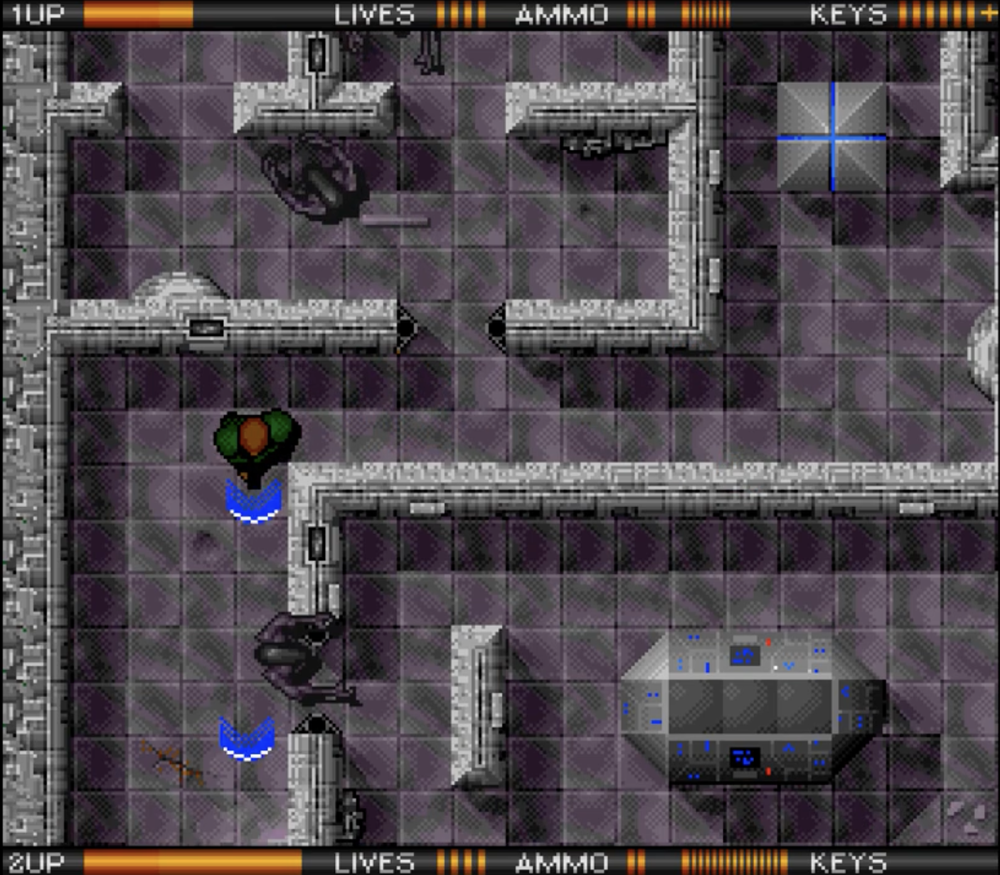

# YAAB - Yet Another Alien Breed

A top-down 2D arcade shooter inspired by the classic Amiga game [Alien Breed](https://en.wikipedia.org/wiki/Alien_Breed) by Team17. Built with [Godot 4.6](https://godotengine.org).



**[Play in your browser](https://yaab.online)**

## About

Survive an alien onslaught in dark, claustrophobic corridors. Enemies patrol the halls and chase you on sight while a proximity-based heartbeat and sonar ping system builds tension as they close in. One hit means death — stay sharp.

## Controls

### Keyboard + Mouse

| Action | Input |
|--------|-------|
| Move forward / back | W / S or Up / Down |
| Aim | Mouse |
| Shoot | Left Mouse Button |
| Run | Left Shift |
| Quit | Escape |

### Gamepad

| Action | Input |
|--------|-------|
| Move and Aim | Left Stick |
| Shoot | B / Circle |
| Run | LT / RT |

## Features

- Top-down pixel-art shooter with tile-based levels
- Enemy AI with patrol and line-of-sight chase behavior
- Proximity-based audio: heartbeat accelerates as enemies approach
- Weapon mechanics with bullet spread, recoil, muzzle flash, and shell ejection
- Wall and enemy bullet impact effects
- Keyboard/mouse and gamepad support
- Playable in the browser via web export

## Getting Started

### Prerequisites

- [Godot 4.6](https://godotengine.org/download) or later
- (Optional) [Tiled](https://www.mapeditor.org/) for level editing

### Setup

1. Clone the repository

```bash
git clone https://github.com/Ben1980/yaab.git
```

2. Open the project in Godot 4.6
3. Press **F5** to run

## Project Structure

```bash
yaab/
├── addons/          # Editor plugins (debug menu)
├── assets/          # Fonts, icons
├── characters/
│   ├── enemies/     # Alien enemy AI, sprites, sounds
│   └── player/      # Player controls, sprites, sounds
├── levels/          # Tile-based level scene and tileset
├── weapons/         # Bullet, impacts, muzzle flash, shell
├── website/         # Landing page (yaab.online)
└── project.godot
```

## Contributing

Contributions are welcome! See [CONTRIBUTING.md](CONTRIBUTING.md) for guidelines.

This project follows the [Contributor Covenant 3.0](CODE_OF_CONDUCT.md) code of conduct.

## License

[MIT](LICENSE) &copy; 2026 YAAB Contributors

## Acknowledgments

- Inspired by [Alien Breed](https://en.wikipedia.org/wiki/Alien_Breed) by Team17
- [Debug Menu](https://github.com/godot-extended-libraries/godot-debug-menu) addon by Calinou
- [Press Start 2P](https://fonts.google.com/specimen/Press+Start+2P) font by CodeMan38
